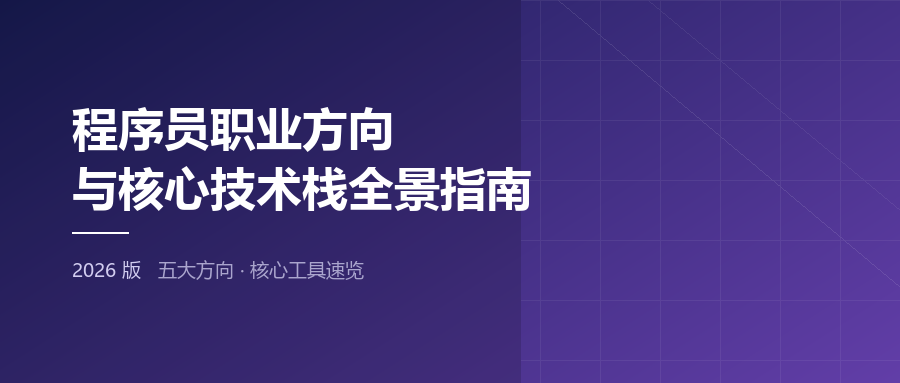
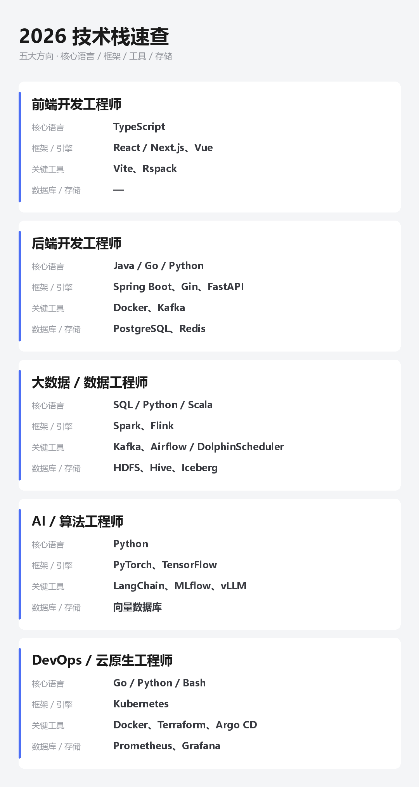

  

# 程序员职业方向与核心技术栈全景指南（2026 版）

一份面向「想搞清楚该往哪个方向走」的技术地图。按**五大主流方向**拆解，每个方向回答三个问题：

- **它在干什么** —— 一句话说清岗位实质
- **要学什么** —— 核心语言 / 框架引擎 / 关键工具 / 数据存储
- **怎么上手** —— 前 90 天的学习顺序，以及这个方向的反面（门槛、淘汰率、常见学习顺序错误）

覆盖方向：**前端 · 后端 · 大数据 · AI/算法 · DevOps/云原生**

**正文 → [article.md](article.md)**

---

## 五个方向速览

| 方向 | 主要做什么 | 入行门槛 | 招聘热度 |
| --- | --- | --- | --- |
| 前端 | 把产品呈现给用户，并保证它好用 | 中低 | 高 |
| 后端 | 承载业务逻辑与数据，互联网的底层基石 | 中 | 最高 |
| 大数据 | 让海量数据能被存下、算清、用起来 | 中高 | 中高 |
| AI / 算法 | 让机器从数据里学到能力 | 最高 | 高（增长最快） |
| DevOps / 云原生 | 让代码可靠地跑起来、发出去、看得见 | 中 | 中高 |

## 技术栈速查

  

## 文中配图

`images/screenshots/` 下 16 张截图，**前缀即所属方向**：

| 前缀 | 方向 | 内容 |
| --- | --- | --- |
| `frontend-` | 前端 | VS Code、Chrome DevTools |
| `backend-` | 后端 | Postman |
| `bigdata-` | 大数据 | Apache Airflow、Spark Web UI |
| `ai-` | 算法 | JupyterLab |
| `devops-` | DevOps | Argo CD、Grafana 接入 Prometheus |

> 图片来自各项目官网，仅用于技术介绍，版权归原作者所有。

## 说明

- 文中的份额、采用率等数字来自公开行业报告与各项目官方数据，不同来源口径可能存在差异，仅供参考。
- 正文里的「官网」链接在成稿时逐个访问验证过可达性。
