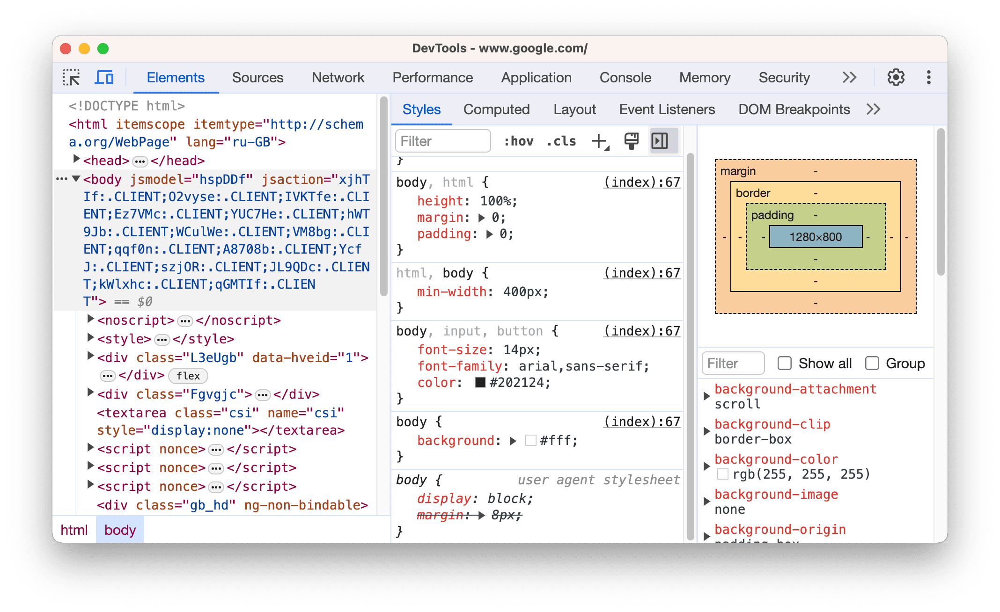
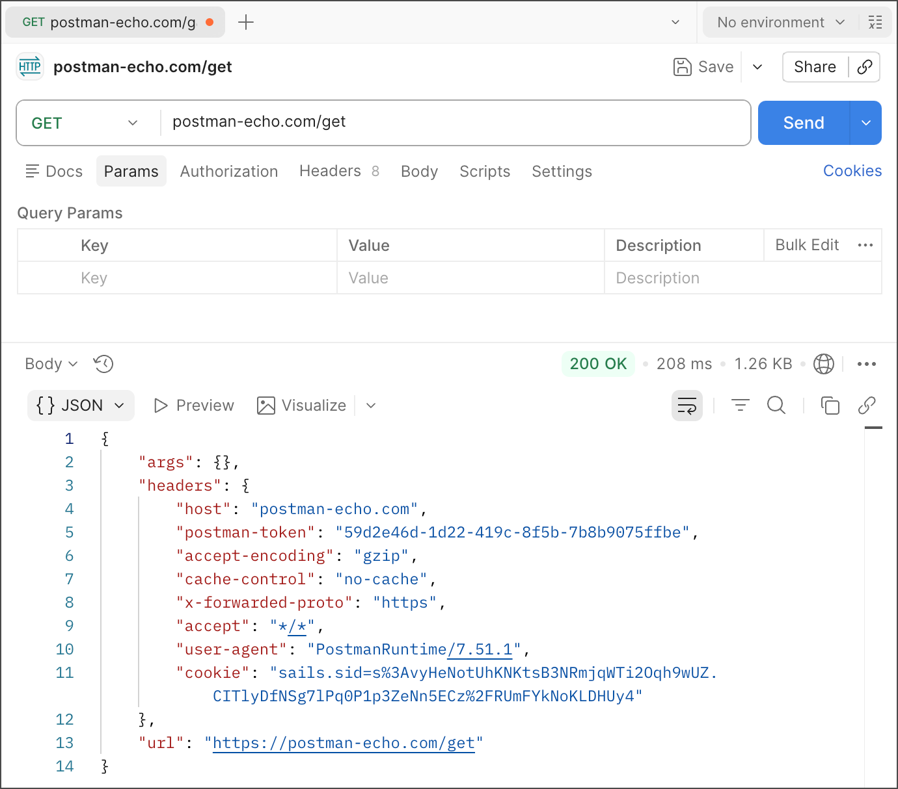
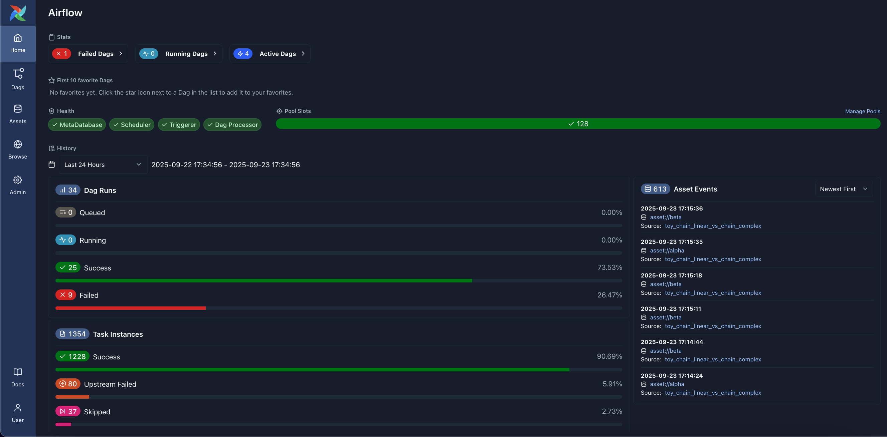
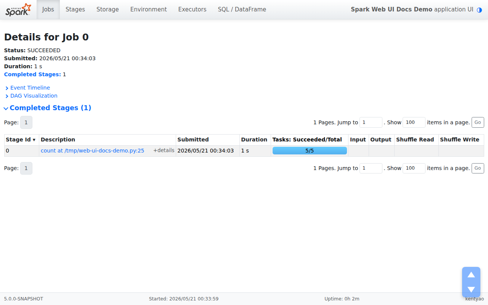
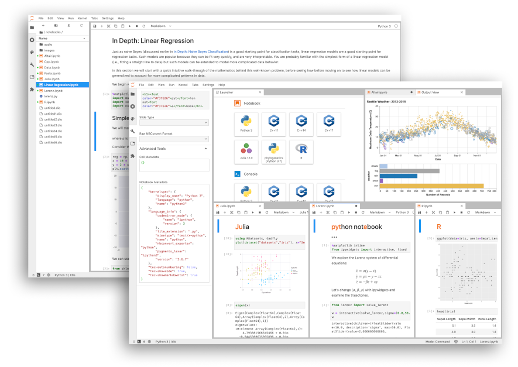
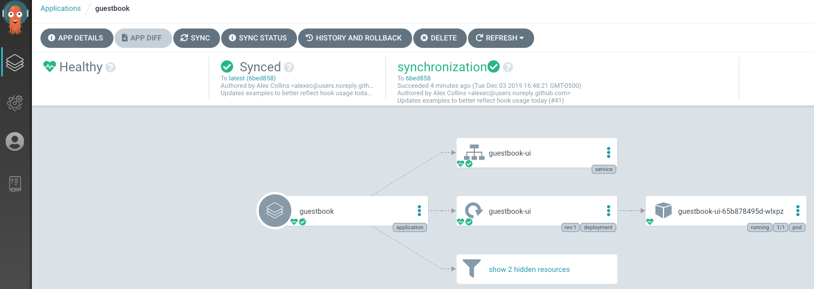
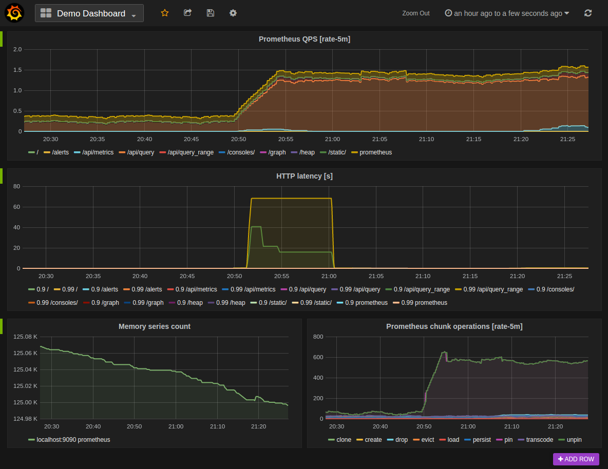

# 程序员职业方向与核心技术栈全景指南（2026 版）

  

*程序员职业方向与核心技术栈全景指南（2026 版）*

## 引言

2026 年的软件开发格局正在经历一轮深刻变革。Rust 工具链大规模重写前端基础设施，Go 在云原生领域的企业采用率超过 70%，AI 辅助编码从"尝鲜"变成了"日常"。面对这样的迭代速度，无论是刚入行的学生还是寻求转型的开发者，都需要一张清晰的技术地图。

这份地图要回答两个问题：**有哪些职业方向，每个方向真正需要掌握什么。**

本文按五大主流方向逐一拆解，只讲各岗位必须掌握的基础工具与核心技术栈，不做罗列式的名词堆砌。

### 五个方向速览

| 方向 | 主要做什么 | 入行门槛 | 招聘热度 |
| --- | --- | --- | --- |
| 前端 | 把产品呈现给用户，并保证它好用 | 中低 | 高 |
| 后端 | 承载业务逻辑与数据，互联网的底层基石 | 中 | 最高 |
| 大数据 | 让海量数据能被存下、算清、用起来 | 中高 | 中高 |
| AI / 算法 | 让机器从数据里学到能力 | 最高 | 高（增长最快） |
| DevOps / 云原生 | 让代码可靠地跑起来、发出去、看得见 | 中 | 中高 |

---

## 一、前端开发工程师

  

*VS Code —— 前端日常待得最久的地方*

  

*Chrome DevTools 元素面板 —— 前端调试的第一现场*

前端早已不是"画页面"的代名词。2026 年的前端聚焦于用户体验、工程化与跨端能力，技术深度和广度都在持续扩展。

**语言与基础**

- **TypeScript** 已成为前端开发的默认语言，用于保障代码契约与类型安全
- **HTML5 语义化**与 **CSS3** 是基础中的基础

**主流框架**

- **React** 市场份额最大，超过 45%；其生态中的 **Next.js 15** 的 App Router 正在成为 React 全栈开发的事实标准
- **Vue 3** 份额稳步提升至约 25%，以平缓的学习曲线著称，国内岗位数量尤其可观

**构建工具**

这是 2026 年变化最大的领域。

- **Vite** 是大多数新项目的默认选择，开发服务器启动时间仅需 4 秒（传统 CRA 需要 45 秒）
- **Rspack** 用 Rust 构建，适合需要兼容 Webpack 生态、同时追求更高性能的场景
- **Turbopack** 已在 Next.js 16 中稳定并默认启用

**状态管理与工程化**

Redux 正被更轻量的方案替代，**Zustand** 这类方案在中小型项目中更受青睐。AI 辅助编码工具（GitHub Copilot、国产的 Qoder、CodeBuddy 等）已成为日常开发标配。

**入门路径**

1. 用三周时间打好 HTML5 与 CSS3 基础，能手写静态页面
2. 直接上 TypeScript，不必先学 JavaScript 再补类型 —— 那是旧路径
3. 跟着 React 官方文档完成一个完整项目，再补 Vite、React Router 与状态管理
4. 把 AI 编码工具当作结对伙伴，重点是学会提问和审查它给出的代码

**需要注意**

前端的门槛低，但技术迭代快，淘汰也快。想避免被替代，必须往工程化、性能优化与跨端方向深入，而不是停留在"会写组件"的层面。如果对"用户能立刻看到结果"有成就感，会学得很顺；如果对频繁更换技术栈感到疲惫，这条路会比较辛苦。

**官网**

- TypeScript　https://www.typescriptlang.org
- React　https://react.dev
- Next.js　https://nextjs.org
- Vue　https://vuejs.org
- Vite　https://vite.dev
- Rspack　https://rspack.dev
- Turbopack　https://turbo.build/pack
- Zustand　https://zustand.docs.pmnd.rs
- GitHub Copilot　https://github.com/features/copilot
- CodeBuddy　https://www.codebuddy.cn
- Qoder　https://qoder.com

---

## 二、后端开发工程师

  

*Postman —— 后端调接口最常用的工具*

后端是互联网的底层基石，招聘量最大，职业生命周期也最长。2026 年的两个显著趋势是 Go 在云原生方向的崛起，以及后端的 AI 化。

**编程语言**

- **Java** 仍是企业级开发的绝对主力，**Spring Boot** 是其标配框架
- **Go** 在云原生基础设施领域采用率已超过 70%。Docker、Kubernetes、Prometheus 等核心工具几乎全部用 Go 编写，这是它在云原生站稳的底层原因
- **Python** 凭借 AI/ML 后端与快速原型开发的需求快速增长，**FastAPI** 在构建现代 API 方面表现突出

**框架生态**

Java 生态以 Spring Boot 为核心；Go 生态轻量型有 **Gin**、**Echo**；企业级 Node.js 方向有 **NestJS**。

**数据库**

- **PostgreSQL** 功能强大，支持 JSON 与复杂查询，适合企业级应用
- **MySQL** 仍是 Web 应用的主流关系型数据库
- **Redis** 用于缓存与会话管理
- **MongoDB** 适合 Schema 灵活的场景

**消息队列与中间件**

**Kafka** 是实时数据管道的标准组件，此外还涉及 **RocketMQ**、**Dubbo** 等微服务框架。

**容器化基础**

**Docker** 已成为后端开发的必备技能。它的价值不只是"会写 Dockerfile"，而在于保证开发环境与生产环境的一致性。

**入门路径**

1. 选定一门语言扎实打底，依据目标公司的技术栈在 Java 与 Go 之间取舍
2. 学习对应框架，独立写出一套完整的增删改查 API
3. 接上 PostgreSQL 与 Redis，用 Docker 把服务完整跑起来
4. 把服务部署到云服务器，并加上日志，体验一次真实的运维

**需要注意**

后端纵深极大 —— 分布式、高并发、中间件原理都值得长期投入。这让它越老越吃香，但也意味着前三年需要耐得住，不像前端那样能快速看到界面反馈。适合喜欢琢磨"为什么这样设计"、对数据一致性与性能问题有兴趣的人。

**官网**

- Java　https://dev.java
- Go　https://go.dev
- Python　https://www.python.org
- Spring Boot　https://spring.io/projects/spring-boot
- Gin　https://gin-gonic.com
- Echo　https://echo.labstack.com
- FastAPI　https://fastapi.tiangolo.com
- NestJS　https://nestjs.com
- PostgreSQL　https://www.postgresql.org
- MySQL　https://www.mysql.com
- Redis　https://redis.io
- MongoDB　https://www.mongodb.com
- Docker　https://www.docker.com
- Kafka　https://kafka.apache.org
- RocketMQ　https://rocketmq.apache.org
- Dubbo　https://dubbo.apache.org

---

## 三、大数据 / 数据工程师

  

*Apache Airflow —— 数据任务的调度中枢*

  

*Spark Web UI —— 看任务跑在哪、慢在哪*

2026 年的数据工程师已经从"写脚本的人"，转变为数据平台的构建者和数据价值的挖掘者。行业里已经形成共识：批处理用 Spark，流处理用 Flink。

**编程语言**

- **SQL** 是数据领域最重要的语言，没有之一
- **Python** 凭借 Pandas、PySpark 等生态稳居首选
- **Scala** 在 Spark 生态中仍有重要地位

**分布式存储与计算基础**

**HDFS** 是 Hadoop 生态的底层分布式文件系统，依然是离线批量数据存储的标配。Hadoop 提供了分布式存储与计算的基础能力；虽然 MapReduce 已逐渐被 Spark 替代，但 HDFS 仍是许多企业数据架构的存储基石。

**批处理与流处理**

- **Spark** 是离线批处理计算的事实标准。它的 DataFrame API 与 Spark SQL 提供了类似 Pandas 的操作体验，却能在数十台服务器上并行处理 PB 级数据
- **Flink** 占据实时流计算的头部位置。它的**事件时间水印机制**与 **Exactly-Once 语义**，保证了金融交易等场景的数据准确性

**消息队列**

**Kafka** 在整个数据管道中扮演数据总线的角色，连接上游生产者与下游消费者。

**数据仓库与调度**

- 数据仓库：**Hive** 是离线数仓的标准工具，**Trino** 与 **ClickHouse** 分别用于交互式分析与高性能 OLAP 查询
- 任务调度：**Apache DolphinScheduler** 是国内企业中大型数据平台选型率最高的调度工具，**Airflow** 则是全球范围内的标准
- 数据采集：**Flume** 与 **Filebeat** 用于日志采集，**Canal** 用于 MySQL binlog 的 CDC 同步
- 数据湖：对象存储（S3 / OSS）配合 **Iceberg**、**Delta Lake** 等开放表格式，正在成为数据湖的主流底座

**入门路径**

1. 把 SQL 练到熟练 —— 这是投入产出比最高的一步，不要跳过
2. 学 Python 与 Pandas，独立完成一份数据清洗与分析
3. 上 Spark，用 PySpark 跑通一个批处理任务
4. 搭一条最小管道：采集到 Kafka，经 Spark 或 Flink 处理，落入数仓

**需要注意**

这个方向的工具特别多，新手最常见的失败方式是每个都学一点。更有效的做法是死磕 SQL、Spark 与一个调度工具，其余用到再学。适合喜欢从杂乱数据里找规律、不排斥与 SQL 和配置打交道的人。

**官网**

- Scala　https://www.scala-lang.org
- Pandas　https://pandas.pydata.org
- Hadoop / HDFS　https://hadoop.apache.org
- Spark　https://spark.apache.org
- Flink　https://flink.apache.org
- Kafka　https://kafka.apache.org
- Hive　https://hive.apache.org
- Trino　https://trino.io
- ClickHouse　https://clickhouse.com
- DolphinScheduler　https://dolphinscheduler.apache.org
- Airflow　https://airflow.apache.org
- Flume　https://flume.apache.org
- Filebeat　https://www.elastic.co/beats/filebeat
- Canal　https://github.com/alibaba/canal
- Iceberg　https://iceberg.apache.org
- Delta Lake　https://delta.io

---

## 四、AI / 算法工程师

  

*JupyterLab —— 算法工程师的主要工作台*

算法岗门槛最高，硕士几乎是起步价，但也是当前需求增长最快的方向。格局上，PyTorch 在研究中占据绝对主导，TensorFlow 在生产部署上更为成熟。

**编程语言与基础**

**Python** 是算法领域的通用语言，配套 **NumPy**、**Pandas** 等数据处理库。数学基础（线性代数、概率论、微积分）需要同步补上。

**深度学习框架**

- **PyTorch** 驱动了顶级 AI 会议上 85% 的深度学习论文。动态计算图与 Pythonic API 让调试和实验变得自然
- **TensorFlow** 在生产部署与企业级可扩展性方面仍有优势，市场占有率约 37%

**经典机器学习**

**scikit-learn** 用于统计与树模型，**XGBoost** 用于结构化数据的梯度提升。

**大模型与 AI Agent**

**LangChain** 与 **Hugging Face** 是构建大模型应用的核心工具。**RAG（检索增强生成）** 是当前最热的应用范式，涉及向量数据库的管理与优化。

**MLOps 工具链**

- **MLflow** 用于实验跟踪与模型管理
- **DVC** 用于数据与流水线的版本控制
- **Kubeflow Pipelines** 用于 K8s 原生的机器学习工作流编排
- **KServe** 用于模型服务部署

**部署工具**

**FastAPI** 用于模型服务封装，**vLLM** 用于大模型高效推理。

**入门路径**

1. 用三周时间打好 Python 与 NumPy、Pandas 基础，同时补数学
2. 走一遍 scikit-learn 与 XGBoost 的完整流程，理解经典机器学习
3. 学 PyTorch，手写一遍训练循环，复现一个小模型
4. 学 RAG，用 LangChain 加向量数据库搭一个能问答的小应用
5. 长期投入读论文与做项目，这个方向必须靠作品说话

**需要注意**

不要只学调库。2026 年会调 LangChain 的人很多，但能读懂论文、改得动模型、讲得清原理的人依然稀缺 —— 后者才是这个岗位真正的门槛。这个方向需要长时间忍受实验失败，适合数学基础扎实、喜欢读论文、能接受不确定性的人。

**官网**

- NumPy　https://numpy.org
- PyTorch　https://pytorch.org
- TensorFlow　https://www.tensorflow.org
- scikit-learn　https://scikit-learn.org
- XGBoost　https://xgboost.readthedocs.io
- LangChain　https://www.langchain.com
- Hugging Face　https://hf-mirror.com（国内镜像站）
- MLflow　https://mlflow.org
- DVC　https://dvc.org
- Kubeflow　https://www.kubeflow.org
- KServe　https://kserve.github.io/website/
- FastAPI　https://fastapi.tiangolo.com
- vLLM　https://docs.vllm.ai

---

## 五、DevOps / 云原生工程师

  

*Argo CD —— 声明式持续部署的控制台*

  

*Grafana 接入 Prometheus —— 标准监控组合*

DevOps 已成为所有开发岗位的通用基础设施能力。掌握容器化与云原生工具，是 2026 年的基本要求，而不只是这个岗位的要求。

**容器化**

**Docker** 是绝对王者。需要掌握 Dockerfile 编写、多阶段构建与镜像优化（体积与安全）。

**容器编排**

**Kubernetes** 是容器编排领域的霸主。需要能用 kubectl 管理 Pod、Service、Deployment 等资源，并能编写基本的 YAML 编排文件。

**基础设施即代码**

**Terraform** 是跨云平台的标准工具，允许用统一语法声明云资源。

**CI/CD 与 GitOps**

**Jenkins**、**GitLab CI**、**GitHub Actions** 是主流选择，至少精通其中一种。**Argo CD** 与 **Flux** 是 2026 年的现代基线，用于实现声明式的持续部署。

**监控与可观测性**

**Grafana** 与 **Prometheus** 是标准组合，用于构建实时监控看板与告警系统。

**云平台**

AWS、阿里云、Azure 各自拥有完整的数据服务生态。78% 的数据工程师岗位明确要求至少熟悉一种云平台的数据服务，这是"云"从加分项变成必选项的直接证据。

**入门路径**

1. 先把 Git 用熟 —— 它是所有方向的地基，不是 DevOps 专属
2. 吃透 Docker，把之前做过的项目容器化
3. 在本地用 minikube 或 kind 跑起 Kubernetes，部署自己的应用
4. 接上 CI/CD，推荐从 GitHub Actions 入手，实现提交代码自动部署

**需要注意**

Kubernetes 不要一上来就啃。先用熟 Docker 再学它，否则容易陷入"懂概念但整不明白"的泥潭 —— 这是新手最常见的顺序错误。适合喜欢把东西跑通跑稳、对系统与自动化有兴趣的人。

**官网**

- Git　https://git-scm.com
- Docker　https://www.docker.com
- Kubernetes　https://kubernetes.io
- Terraform　https://developer.hashicorp.com/terraform
- Jenkins　https://www.jenkins.io
- GitLab CI　https://docs.gitlab.com/ee/ci/
- GitHub Actions　https://github.com/features/actions
- Argo CD　https://argo-cd.readthedocs.io
- Flux　https://fluxcd.io
- Grafana　https://grafana.com
- Prometheus　https://prometheus.io
- AWS　https://aws.amazon.com
- 阿里云　https://www.aliyun.com
- Azure　https://azure.microsoft.com

---

## 技术栈速查表

  

*2026 技术栈速查表*

| 方向 | 核心语言 | 必备框架 / 引擎 | 关键工具 | 数据库 / 存储 |
| --- | --- | --- | --- | --- |
| 前端 | TypeScript | React / Next.js、Vue | Vite、Rspack | — |
| 后端 | Java / Go / Python | Spring Boot、Gin、FastAPI | Docker、Kafka | PostgreSQL、Redis |
| 大数据 | SQL / Python / Scala | Spark、Flink | Kafka、Airflow / DolphinScheduler | HDFS、Hive、Iceberg |
| 算法 | Python | PyTorch、TensorFlow | LangChain、MLflow、vLLM | 向量数据库 |
| DevOps | Go / Python / Bash | Kubernetes | Docker、Terraform、Argo CD | Prometheus、Grafana |

---

## 结语

2026 年的技术栈呈现出几条清晰的脉络：Rust 正在重塑工具链底层，涵盖前端构建与数据引擎；Go 在云原生领域已形成统治地位；Python 在 AI 领域持续扩张；而 Java 仍牢牢把持着企业级开发。

对学习者来说，更有效的路径是先选定一个方向深入，掌握该方向的核心工具链，再逐步向相邻方向拓展。技术栈是积累出来的，不是一次性学完的。五个方向各学一点，反而是最没有竞争力的状态。

---

*数据说明：文中份额、采用率等数字来自公开行业报告与各项目官方数据，不同来源的口径可能存在差异，仅供参考。*

*图片来自各项目官网，仅用于技术介绍，版权归原作者所有。*
